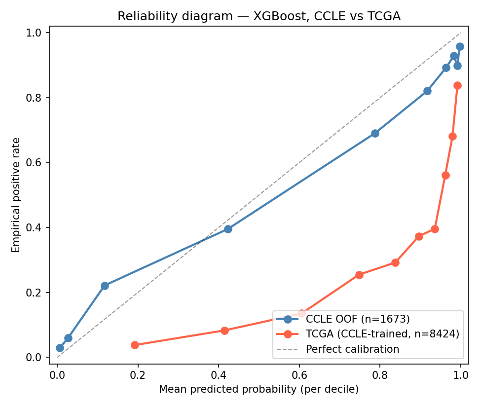
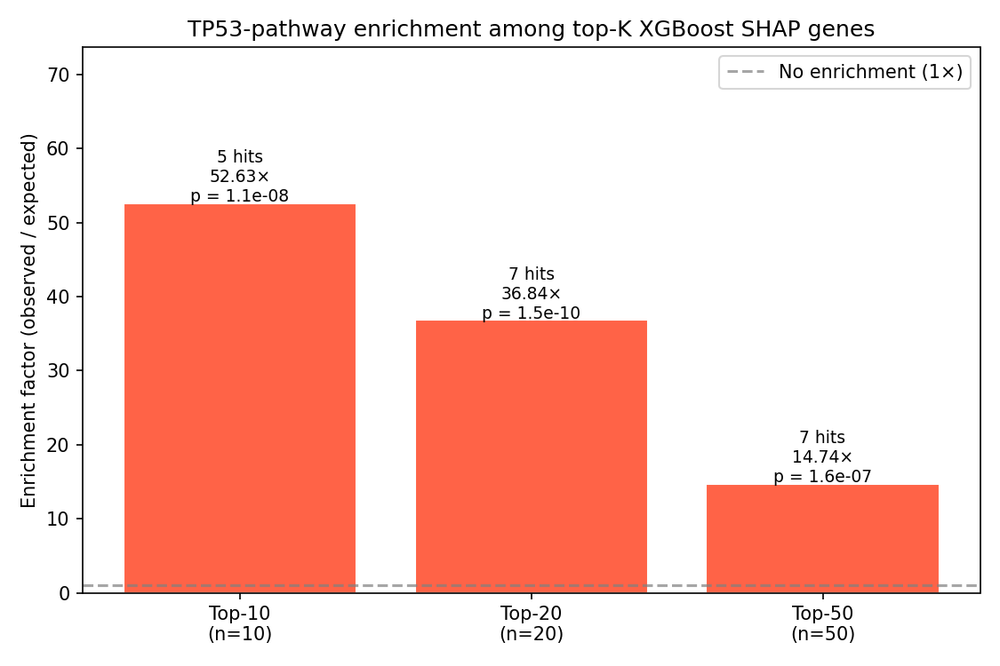
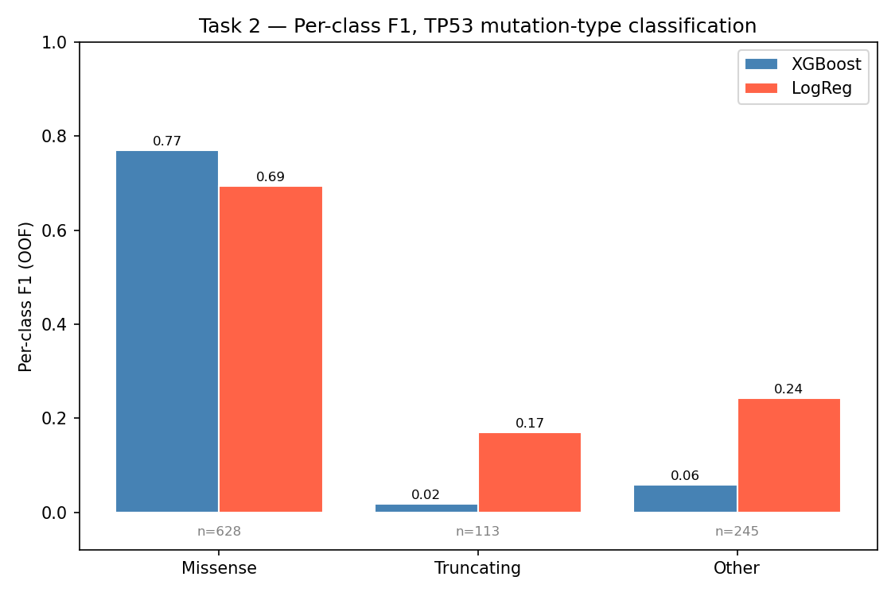

# TP53 Mutation Predictor

A biologically informed machine-learning pipeline for predicting TP53 mutation **status** and **type** from bulk RNA-seq, with biologically-informed graph priors (STRING PPI), SHAP-based interpretability, and external validation on TCGA primary tumours.

> An MSc-level computational oncology project — built on CCLE (DepMap 24Q4) cell-line transcriptomes, validated on 8,424 TCGA primary tumours, and interpreted against a curated TP53 pathway gene set.

---

## TL;DR

**Task 1 — Binary mutation status:**
- **Best model — XGBoost** on top-2,000 highly variable genes: **F1 = 0.875, ROC-AUC = 0.906** on CCLE 5-fold CV.
- **External validation on TCGA** (n = 8,424 primary tumours, per-cohort z-score): **ROC-AUC = 0.806**, F1 = 0.604 at default threshold; **F1 rises to 0.641** with prevalence-matched threshold calibration.
- **Best GNN — GAT** on a hybrid (STRING PPI ∪ co-expression) graph: F1 = 0.760, ROC-AUC = 0.706 on CCLE — beats every GCN variant but still trails XGBoost.
- **CDKN1A (p21) dominates SHAP**: mean |SHAP| = 1.27, three times the next gene. **Hypergeometric test** confirms top-K SHAP genes are extremely enriched for the curated TP53 pathway — **52.6× at top-10 (p = 1.07 × 10⁻⁸)**, 36.8× at top-20, 14.7× at top-50.
- **Honest negative result**: vanilla GCN/GAT models do **not** transfer to TCGA (AUC ≈ 0.4) under the same z-score protocol that works for XGBoost. Cause: BatchNorm distribution shift + raw-feature scale mismatch.

**Task 2 — Multiclass mutation type (TP53-mutant subset, n = 986):**
- 3-class problem (Missense / Truncating = Frame_Shift ∪ Splice / Other), heavy imbalance (64 / 11 / 25 %).
- **XGBoost** (multi:softprob): accuracy 0.627 (high — by predicting majority class), macro-F1 0.282, weighted-F1 0.507.
- **Logistic Regression** (multinomial L2): accuracy 0.540, **macro-F1 0.369** (best balanced metric), OvR macro AUC 0.570.
- Mutation TYPE is intrinsically harder than mutation STATUS — all loss-of-function variants converge on the same downstream transcriptional collapse, so the bulk transcriptome cannot easily distinguish *how* TP53 was hit.

**Final scientific conclusion** — XGBoost performs best and transfers to TCGA; SHAP recovers canonical TP53 biology with formal statistical support (p ≈ 10⁻⁸ to 10⁻¹⁰); GNNs improve with better design but remain weaker and fail external transfer due to domain shift; multiclass mutation-type prediction is intrinsically harder than mutation-status prediction, consistent with the loss-of-function biology of TP53.

> **The full deliverable report is [`notebooks/02_final_report.ipynb`](notebooks/02_final_report.ipynb)** — 10 sections from abstract to references, with embedded tables and figures regenerated from `data/processed/`.


---

## Research questions

1. **Expression → Mutation (prediction):** Can we predict TP53 mutation status (binary) and subtype (multi-class) from bulk RNA-seq profiles?
2. **Generalisation:** Does a model trained on cell-line transcriptomes (CCLE) transfer to primary tumours (TCGA)?
3. **Biological priors:** Do biologically-informed graph priors (STRING PPI) outperform statistical co-expression graphs in graph-based models?
4. **Interpretability:** Are the model's important features biologically aligned with the canonical TP53 transcriptional program?

All four questions are addressed with explicit comparisons, full metrics, statistical tests, and per-cancer-type breakdowns on TCGA.

---

## Datasets

| Cohort | Source | Samples | Expression format | Labels |
|---|---|---:|---|---|
| **CCLE** (training) | DepMap Public 24Q4 | 1,673 cell lines | log₂(TPM+1), RSEM | `tp53_binary`, `tp53_class` (5-way) |
| **TCGA** (external) | UCSC Xena PanCancer Atlas | 8,424 primary tumours | log₂(norm_count+1) | `tp53_binary`, `cancer_type` |

CCLE has TP53 mutation rate **58.9 %**; TCGA has **36.5 %**. The 22-percentage-point gap reflects the well-documented selection bias from immortalisation. Per-cancer-type TP53 prevalence in TCGA spans 0 % (UVM) to 91 % (UCS), recapitulating the textbook landscape.

---

## Repository layout

```
tp53-mutation-predictor/
├── data/
│   ├── raw/                            (gitignored — source files)
│   │   ├── OmicsExpression*.csv        CCLE expression  (DepMap 24Q4)
│   │   ├── OmicsSomaticMutations.csv
│   │   ├── string/                     STRING PPI (auto-downloaded)
│   │   └── tcga/                       TCGA Xena files (auto-downloaded)
│   └── processed/                      generated artefacts (committed)
│       ├── top_genes.csv               top-2k HVG gene order
│       ├── cv_splits.csv               5-fold stratified split assignments
│       ├── gene_graph_*.npz            5 graph variants (Spearman / STRING / hybrid)
│       ├── *_metrics.json              per-model evaluation metrics
│       ├── *_oof_preds.csv             out-of-fold predictions
│       ├── shap_top20.csv, shap_enrichment.csv
│       ├── threshold_calibration*.csv/json
│       ├── multiclass_*.csv/json       Task 2 outputs
│       ├── tcga_*.csv/json             TCGA external validation
│       └── plots/                      all figures
│
├── notebooks/
│   ├── 02_final_report.ipynb           ⭐ MAIN DELIVERABLE — research report
│   ├── gene_expression/
│   │   └── 01_EDA.ipynb                CCLE exploratory data analysis
│   ├── 02_tcga_data_loading.ipynb      TCGA loading + merging (GDC RSEM + MC3 MAF)
│   ├── 03_tcga_eda.ipynb               TCGA EDA
│   └── 04_tcga_preprocessing.ipynb     TCGA preprocessing → tcga_preprocessed.csv.gz
│
├── src/
│   ├── load_data.py                    CCLE expression + label derivation
│   ├── train_xgb.py                    XGBoost 5-fold CV (binary)
│   ├── train_multiclass.py             XGB + LogReg (Task 2 multiclass)
│   ├── train_gnn.py                    GCN / GAT 5-fold CV training loop
│   ├── gcn.py, gat.py                  configurable architectures
│   ├── graph_construction.py           Spearman co-expression graphs
│   ├── build_bio_graph.py              STRING PPI + hybrid graph
│   ├── shap_analysis.py                SHAP for XGBoost
│   ├── shap_enrichment.py              hypergeometric / Fisher pathway test
│   ├── threshold_calibration.py        TCGA threshold + reliability diagram
│   ├── tp53_pathway.py                 curated TP53 pathway (62 HGNC symbols)
│   ├── tcga_load.py                    UCSC Xena TCGA download + harmonisation
│   ├── tcga_eval.py                    XGBoost CCLE → TCGA validation
│   ├── tcga_gnn_eval.py                GCN / GAT CCLE → TCGA validation
│   ├── domain_comparison.py            CCLE vs TCGA: PCA + distributions
│   └── make_plots.py                   unified ROC / PR / CM / comparison plots
│
├── jobs/                               SLURM scripts (Bocconi HPC)
├── logs/                               SLURM stdout/stderr
├── PROJECT_NOTES.md                    detailed decisions + run log
├── README.md                           this file
└── environment.yml                     conda environment
```

---

## Setup

### Local
```bash
git clone https://github.com/juliavikr/tp53-mutation-predictor.git
cd tp53-mutation-predictor
conda env create -f environment.yml
conda activate tp53-predictor
```

### HPC (Bocconi cluster, SLURM)
```bash
module load miniconda3 cuda/12.4
conda env create -f environment.yml
conda activate tp53-predictor
```

### Data download

**CCLE (DepMap 24Q4)** — manual, place in `data/raw/`:
- `OmicsExpressionProteinCodingGenesTPMLogp1.csv`
- `OmicsSomaticMutations.csv`

**TCGA (Xena path)** — auto-downloaded by `src/tcga_load.py`.

**STRING (v12.0 physical PPI)** — auto-downloaded by `src/build_bio_graph.py`.

---

## Reproducing every result

```bash
# 1. CCLE: top-2k HVG + XGBoost baseline (binary)
python src/train_xgb.py

# 2. Build all 5 graphs
python src/graph_construction.py --mode threshold --threshold 0.5 --name thr05
python src/graph_construction.py --mode threshold --threshold 0.7 --name thr07
python src/graph_construction.py --mode topk --top-k 10 --name topk10
python src/build_bio_graph.py --score 700      # bio + hybrid

# 3. GCN-v2 across all 5 graphs (HPC)
sbatch --export=ALL,RUN_NAME=v2_thr05,GRAPH_FILE=gene_graph_thr05.npz   jobs/train_gnn_v2.sbatch
sbatch --export=ALL,RUN_NAME=v2_thr07,GRAPH_FILE=gene_graph_thr07.npz   jobs/train_gnn_v2.sbatch
sbatch --export=ALL,RUN_NAME=v2_topk10,GRAPH_FILE=gene_graph_topk10.npz jobs/train_gnn_v2.sbatch
sbatch --export=ALL,RUN_NAME=v2_bio,GRAPH_FILE=gene_graph_bio.npz       jobs/train_gnn_v2.sbatch
sbatch --export=ALL,RUN_NAME=v2_hybrid,GRAPH_FILE=gene_graph_hybrid.npz jobs/train_gnn_v2.sbatch

# 4. GAT on the best dense graphs
sbatch --export=ALL,RUN_NAME=gat_thr07,GRAPH_FILE=gene_graph_thr07.npz   jobs/train_gat.sbatch
sbatch --export=ALL,RUN_NAME=gat_hybrid,GRAPH_FILE=gene_graph_hybrid.npz jobs/train_gat.sbatch

# 5. Interpretability
python src/shap_analysis.py        # SHAP top-K + plots
python src/shap_enrichment.py      # hypergeometric / Fisher test

# 6. TCGA external validation
python src/tcga_load.py            # download + harmonise
python src/tcga_eval.py            # XGBoost transfer (with z-score)
python src/threshold_calibration.py # threshold + reliability diagram

# 7. Domain comparison (PCA, distributions, prevalence)
python src/domain_comparison.py

# 8. Task 2 — multiclass mutation type
python src/train_multiclass.py

# 9. Final figures (auto-discovers all variants)
python src/make_plots.py
```

---

## Task 1 — Binary mutation status

### CCLE within-cohort (5-fold OOF, n = 1,673)

| Model | Accuracy | Precision | Recall | F1 | ROC-AUC | PR-AUC |
|---|---:|---:|---:|---:|---:|---:|
| **XGBoost** | **0.847** | **0.843** | 0.910 | **0.875** | **0.906** | **0.909** |
| GAT hybrid | 0.654 | 0.643 | **0.928** | **0.760** | 0.706 | 0.746 |
| GCN v2 thr=0.7 | 0.663 | 0.668 | 0.853 | 0.749 | 0.707 | 0.759 |
| GCN v2 hybrid | 0.667 | 0.709 | 0.737 | 0.723 | 0.705 | 0.760 |
| GCN baseline (v1) | 0.595 | 0.608 | 0.879 | 0.719 | 0.625 | 0.705 |
| GCN v2 thr=0.5 | 0.664 | 0.720 | 0.705 | 0.712 | 0.701 | 0.751 |
| GAT thr=0.7 | 0.579 | 0.616 | 0.759 | 0.680 | 0.622 | 0.710 |
| GCN v2 top-k=10 | 0.646 | 0.746 | 0.606 | 0.669 | 0.704 | 0.758 |
| GCN v2 bio | 0.626 | 0.700 | 0.640 | 0.668 | 0.678 | 0.740 |


### Graph variants

| Graph | Mode | Spec | Edges (undirected) | Avg degree |
|---|---|---|---:|---:|
| Spearman ≥ 0.5 | threshold | \|ρ\| ≥ 0.5 | 59,701 | 59.7 |
| Spearman ≥ 0.7 | threshold | \|ρ\| ≥ 0.7 | 2,556 | 2.6 |
| Top-k = 10 | top-k per gene | k = 10 | 18,131 | 18.1 |
| **STRING physical** | PPI | combined_score ≥ 700 | **1,851** | **1.85** |
| **Hybrid** (bio ∪ coexp) | union | — | **61,183** | **61.2** |

**STRING and Spearman are nearly disjoint** (Jaccard = **0.006**). Only ~20 % of bio edges have matching co-expression; only 0.6 % of co-expression edges have direct PPI support — two complementary views of "interaction".

### Threshold calibration on TCGA

The default threshold of 0.5 is mis-calibrated for TCGA (predicted positive rate 0.81 vs true rate 0.37). Three operating points compared:

| Strategy | Threshold | Accuracy | Precision | Recall | F1 | pred_pos_rate |
|---|---:|---:|---:|---:|---:|---:|
| default | 0.500 | 0.536 | 0.439 | 0.970 | 0.604 | 0.807 |
| F1-optimal (CCLE) | 0.450 | 0.514 | 0.428 | 0.975 | 0.594 | 0.833 |
| **prevalence-matched** | **0.931** | **0.738** | **0.641** | **0.641** | **0.641** | **0.365** |



The reliability diagram shows TCGA points sit far below the diagonal — the model's probability scores systematically over-estimate the true positive rate. The prevalence-matched threshold (0.93) lifts F1 from 0.604 → 0.641 with no retraining.

### Interpretability — SHAP on XGBoost


| Rank | Gene | Mean \|SHAP\| | TP53 pathway? |
|---:|---|---:|---|
| **1** | **CDKN1A** | **1.270** | direct target — **p21** |
| 2 | CDKN2A | 0.393 | wider pathway (p16) |
| 3 | INPP5D | 0.337 | other |
| **4** | **PHLDA3** | 0.311 | direct target |
| **5** | **BTG2** | 0.230 | direct target |
| **6** | **CYFIP2** | 0.206 | direct target |
| **14** | **TNFRSF10D** | 0.070 | direct target (DR6) |
| **17** | **FAS** | 0.069 | direct target |

**CDKN1A (p21) dominates** — three times larger than the next gene. The XGBoost has independently rediscovered the canonical TP53 → p21 axis from raw expression alone, with no pathway supervision. Six of the top-20 SHAP genes are direct TP53 transcriptional targets (CDKN1A, PHLDA3, BTG2, CYFIP2, TNFRSF10D, FAS) plus CDKN2A in the wider pathway.

### Pathway enrichment (formal statistical test)

One-sided hypergeometric test: H₀ = top-K SHAP genes are a uniform-random sample of the 2,000-gene background; pathway = 19/2,000 background genes are TP53-pathway members.

| K | Observed hits | Expected | Enrichment | hypergeom p | Fisher OR | Fisher p |
|---:|---:|---:|---:|---:|---:|---:|
| 10 | 5 | 0.10 | **52.6×** | **1.07 × 10⁻⁸** | 141.1 | 1.07 × 10⁻⁸ |
| 20 | 7 | 0.19 | **36.8×** | **1.45 × 10⁻¹⁰** | 88.3 | 1.45 × 10⁻¹⁰ |
| 50 | 7 | 0.47 | **14.7×** | **1.59 × 10⁻⁷** | 26.3 | 1.59 × 10⁻⁷ |



All three K values are extremely significant — strongly rejecting the random-feature null. The model's important features are biologically aligned with the canonical TP53 transcriptional program.

### TCGA external validation (XGBoost)

| Metric | CCLE OOF (1,851 shared genes) | TCGA external | Drop |
|---|---:|---:|---:|
| Accuracy | 0.851 | 0.536 | -0.315 |
| Precision | 0.850 | 0.439 | -0.411 |
| Recall | 0.906 | 0.970 | +0.064 |
| F1 | 0.877 | 0.604 | -0.273 |
| **ROC-AUC** | **0.904** | **0.806** | **-0.099** |
| PR-AUC | 0.906 | 0.700 | -0.206 |


**ROC-AUC drops only ~0.10** — real cross-cohort discriminative power. **Per-cancer-type AUC > 0.85 on 8 of 31 cancer types** (SKCM 0.97, PCPG 0.94, READ 0.88, ACC 0.87, KICH 0.86, UCEC 0.86, LGG 0.86, LIHC 0.85). Threshold calibration further lifts pan-TCGA F1 from 0.604 to **0.641**.

### GNN cross-cohort failure (honest negative result)

| Model | CCLE val AUC | TCGA AUC | TCGA F1 | TCGA recall |
|---|---:|---:|---:|---:|
| GCN v2 thr=0.7 | 0.707 | **0.411** | 0.000 | 0.000 |
| GAT hybrid | 0.722 | **0.392** | 0.000 | 0.000 |

Both GNN models predict every TCGA sample as wild-type. AUC < 0.5 means the rankings are slightly anti-correlated. **Causes**: (a) BatchNorm running statistics fit on CCLE-distributed activations break under TCGA shift, (b) the raw-expression node feature is on a different absolute scale (CCLE log2(TPM+1) RSEM vs TCGA log2(norm_count+1) Xena). Tree models tolerate this; end-to-end GNN weights cascade the shift.

The principled fix is **explicit cross-cohort training** (DANN, CORAL, LayerNorm in place of BatchNorm, or fine-tuning on a TCGA subset) — flagged as future work.

---

## Task 2 — Multiclass mutation type

Predicting TP53 mutation **type** within the TP53-mutant subset (n = 986).

**Class merge rule** — Frame_Shift_Del (n = 48) and Splice_Site (n = 65) were each individually too small for stable 5-fold CV; both functionally truncate the protein, so we merge them into `Truncating`.

| Class | n | Fraction |
|---|---:|---:|
| Missense | 628 | 64 % |
| Other | 245 | 25 % |
| Truncating | 113 | 11 % |

### Models

| Model | Accuracy | Macro-F1 | Weighted-F1 | OvR macro AUC |
|---|---:|---:|---:|---:|
| **XGBoost** (multi:softprob) | **0.627** | 0.282 | **0.507** | 0.548 |
| **LogReg** (multinomial L2) | 0.540 | **0.369** | 0.522 | **0.570** |



### Per-class F1 (Missense / Truncating / Other)

| Model | Missense | Truncating | Other |
|---|---:|---:|---:|
| XGBoost | 0.77 | **0.02** | 0.06 |
| LogReg  | 0.69 | **0.17** | 0.24 |

XGBoost achieves higher accuracy by collapsing to the majority class. Logistic Regression actually distinguishes minority classes — the better balanced metric (macro-F1 = 0.37 > 0.28). Each class recruits a partially distinct expression signature in the per-class XGBoost top genes (`data/processed/top_genes_multiclass.csv`), but **none of the per-class top genes are canonical TP53 targets** — in contrast to Task 1 — suggesting that mutation-type discrimination relies on *secondary* transcriptional fingerprints rather than the primary p53 regulome.

**Biological interpretation** — TP53 mutation TYPE is fundamentally harder to predict from bulk transcriptome than mutation STATUS, because all TP53 loss-of-function variants converge on the same downstream phenotype (loss of p21 induction, altered apoptosis, etc.). The bulk transcriptome carries strong signal for *whether* TP53 is functional, only weak signal for *how* it was knocked out. **This is itself a meaningful finding** — it confirms the Task-1 signal is dominated by mutation status, not subtype.

**TCGA multiclass and GNN multiclass were deferred** — TCGA mutation-type harmonisation across CCLE (VEP MolecularConsequence) and TCGA (MAF Variant_Classification) is non-trivial, and GNNs already trail XGBoost on the easier binary task.

---

## Conclusions

**Final scientific summary:**

1. **XGBoost performs best and transfers to TCGA**. Within-cohort F1 = 0.875, ROC-AUC = 0.906; on 8,424 TCGA primary tumours, ROC-AUC = 0.806 with per-cohort z-score normalisation (gap of only 0.10). Per-cancer-type AUC > 0.85 on 8 of 31 cancers; threshold calibration lifts F1 from 0.604 to 0.641.

2. **SHAP recovers canonical TP53 biology with formal statistical support**. CDKN1A (p21) dominates by a 3× margin; hypergeometric test on top-K SHAP genes shows enrichment factors of **52.6× / 36.8× / 14.7× at K = 10/20/50** with p-values from **10⁻⁷ to 10⁻¹⁰** — strongly rejecting the random-feature null. The model has independently learned the canonical TP53 → p21 transcriptional axis.

3. **GNNs improve substantially with better design** (BatchNorm + residual + balanced loss + early stopping closes about half the gap to XGBoost on the baseline GCN), and **GAT on a hybrid bio∪coexp graph reaches the highest GNN F1 (0.760)**. But all GNN variants remain weaker than XGBoost on within-cohort metrics, and **they fail external transfer to TCGA** under the same z-score protocol. The failure mode is BatchNorm distribution shift + raw-feature scale mismatch — domain-adaptation methods are the principled fix.

4. **Multiclass mutation-type prediction is intrinsically harder** than mutation-status prediction. Logistic regression achieves the best macro-F1 (0.37); XGBoost achieves higher accuracy but only by predicting the majority class. Consistent with the loss-of-function biology of TP53 — variants converge on the same downstream phenotype.

> **For the full deliverable report with embedded tables, figures, and biological commentary, open [`notebooks/02_final_report.ipynb`](notebooks/02_final_report.ipynb).**

---

## Future work

- **GNN domain adaptation** — DANN, CORAL, LayerNorm in place of BatchNorm, or fine-tuning on a labelled TCGA subset to recover cross-cohort transfer.
- **Multiclass external validation** — harmonise mutation-type labels across CCLE (VEP) and TCGA (MAF Variant_Classification).
- **Optuna hyperparameter search** — currently fixed defaults.
- **TP53-target-only feature set** vs HVG — does biology-driven feature selection match HVG performance?
- **Multi-omics integration** — methylation, copy-number, mutation matrix.
- **Patient-level survival analysis** stratified by predicted TP53 status — clinical actionability.

---

## License

MIT — see [LICENSE](LICENSE).

## Acknowledgements

- **CCLE** — Cancer Cell Line Encyclopedia / Broad DepMap Public 24Q4.
- **TCGA PanCancer Atlas** — UCSC Xena hub.
- **STRING DB** v12.0 — physical protein-protein interactions.
- **Ravasio (2024)** — *"Predicting TP53 Mutation Status from scRNA-seq with Graph Neural Networks"* — bulk benchmark and methodological inspiration.
- Computing on the **Bocconi HPC cluster** (`stud` partition, A100 GPUs).

For the complete record of every result, design decision, and issue encountered during the run, see [`PROJECT_NOTES.md`](PROJECT_NOTES.md).
