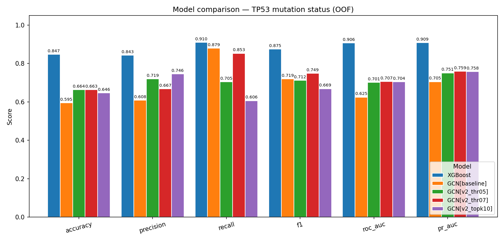
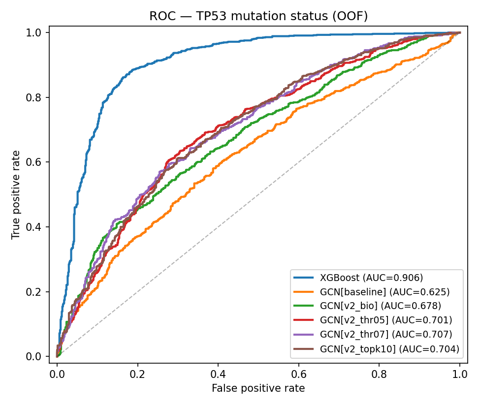
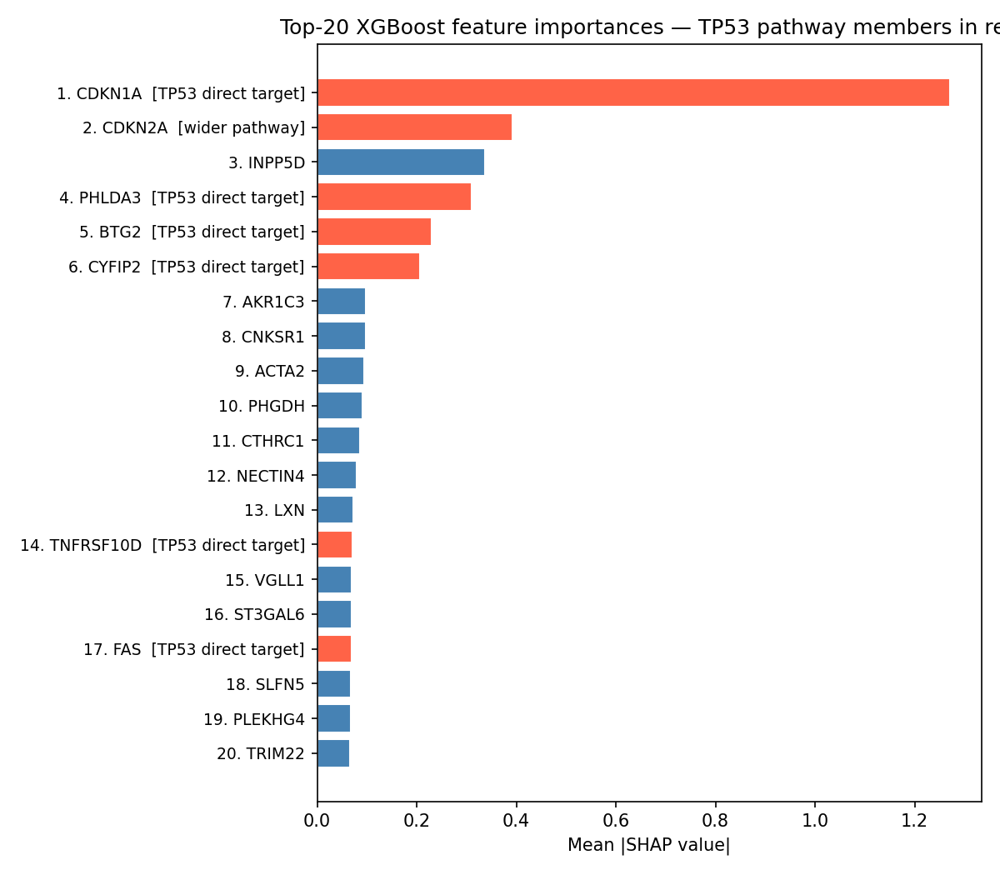
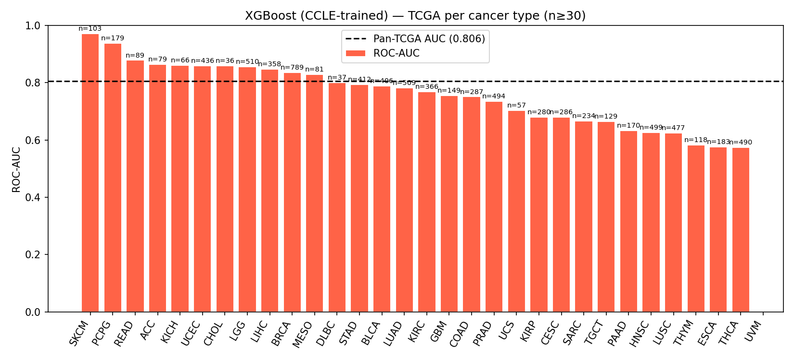

# TP53 Mutation Predictor

Predicting TP53 mutation status from bulk RNA-seq with classical and graph-based machine learning, including biologically-informed graph priors (STRING PPI) and external validation on TCGA primary tumours.

> An MSc-level computational oncology pipeline — built on CCLE (DepMap 24Q4) cell-line transcriptomes, validated on 8,424 TCGA primary tumours, and interpreted against a curated TP53 pathway gene set.

---

## TL;DR

- **Task** — binary classification: TP53 mutant vs wild-type from gene expression.
- **Best model** — XGBoost on top-2,000 highly variable genes: **F1 = 0.875, ROC-AUC = 0.906** on CCLE 5-fold CV; **F1 = 0.604, ROC-AUC = 0.806** on 8,424 TCGA primary tumours (z-scored per cohort).
- **Best GNN** — GAT on a hybrid (STRING PPI ∪ co-expression) graph: F1 = 0.760, ROC-AUC = 0.706 on CCLE — beats every GCN variant but still trails XGBoost.
- **Top SHAP feature** — **CDKN1A (p21)** dominates with mean |SHAP| = 1.27, three times the next gene. Six of the top 20 features are direct TP53 transcriptional targets — the model independently rediscovered the canonical TP53 → p21 axis.
- **Honest negative result** — vanilla GCN/GAT models do **not** transfer to TCGA (AUC ≈ 0.4) under the same per-cohort z-score protocol that lets XGBoost transfer. Likely causes: BatchNorm distribution shift, raw-expression scale mismatch (CCLE log2(TPM+1) vs TCGA log2(norm_count+1)). Domain-adaptation methods (DANN, CORAL, LayerNorm, fine-tuning) are the principled fix.



---

## Why this project

**TP53** is the most frequently mutated gene in human cancer ("guardian of the genome"). Detecting its mutation status from transcriptional profiles alone is biologically interesting because TP53 loss leaves a measurable downstream signature (loss of p21 induction, altered apoptosis programs, etc.). It's also a controlled benchmark for two open ML questions:

1. Do **biologically-informed graph priors** (PPI networks, pathway membership) outperform statistical ones (Spearman co-expression) when used as graph topology for GNNs?
2. Do **graph neural networks** generalise across cell-line and primary-tumour cohorts as well as gradient-boosted trees?

This project answers both questions with explicit comparisons, full metrics, and per-cancer-type breakdowns on TCGA.

---

## Repository layout

```
src/
├── load_data.py            CCLE expression + TP53 label derivation (DepMap 24Q4)
├── train_xgb.py            XGBoost 5-fold stratified CV
├── graph_construction.py   Spearman gene-gene graphs (threshold + top-k modes)
├── build_bio_graph.py      STRING physical PPI graph + hybrid (bio ∪ coexp)
├── gcn.py                  Configurable GCN (n_layers, hidden_dim, BN, residual)
├── gat.py                  Configurable GAT (heads, n_layers, BN, residual)
├── train_gnn.py            5-fold CV training loop (GCN / GAT)
├── tp53_pathway.py         Curated TP53 pathway gene set (62 HGNC symbols)
├── shap_analysis.py        SHAP for XGBoost + pathway annotation
├── tcga_load.py            UCSC Xena TCGA pan-cancer download + harmonisation
├── tcga_eval.py            XGBoost CCLE → TCGA validation
├── tcga_gnn_eval.py        GCN / GAT CCLE → TCGA validation
├── domain_comparison.py    PCA + prevalence + expression-distribution plots
└── make_plots.py           Auto-discovers all variants → comparison plots

jobs/
├── train_xgb.sbatch        XGBoost CPU
├── train_gnn.sbatch        original v1 GCN
├── train_gnn_v2.sbatch     parametric GCN v2  (RUN_NAME, GRAPH_FILE via --export)
├── train_gat.sbatch        parametric GAT
└── tcga_gnn.sbatch         TCGA inference for GNN / GAT

data/processed/             metrics tables, OOF predictions, training curves,
                            graph artefacts, plots/ (rendered on GitHub)
notebooks/                  EDA notebook (CCLE expression + label distribution)
PROJECT_NOTES.md            full research-grade write-up — every result, every
                            issue, every design decision
```

---

## Setup

### Local
```bash
git clone https://github.com/juliavikr/tp53-mutation-predictor.git
cd tp53-mutation-predictor
conda env create -f environment.yml
conda activate tp53-predictor
```

### HPC (Bocconi cluster, SLURM)
```bash
module load miniconda3
conda env create -f environment.yml
```

Environment includes: PyTorch, PyTorch Geometric, scikit-learn, XGBoost, SHAP, pandas, numpy, scipy, seaborn, matplotlib.

### Data — download into `data/raw/`
- **CCLE (DepMap 24Q4)** — `OmicsExpressionProteinCodingGenesTPMLogp1.csv` and `OmicsSomaticMutations.csv` (or run the EDA notebook with `tcga_load.py`-style download helpers).
- **TCGA pan-cancer** — `python src/tcga_load.py` automatically pulls expression + mutations + clinical from UCSC Xena.
- **STRING v12.0** — `python src/build_bio_graph.py` automatically pulls the human physical PPI network.

---

## Pipeline — reproducing every result

```bash
# 1. XGBoost baseline (5-fold CV, top-2k HVG)
python src/train_xgb.py --n-genes 2000 --n-splits 5

# 2. Build all five graph variants
python src/graph_construction.py --mode threshold --threshold 0.5 --name thr05
python src/graph_construction.py --mode threshold --threshold 0.7 --name thr07
python src/graph_construction.py --mode topk --top-k 10 --name topk10
python src/build_bio_graph.py --score 700  # bio + hybrid

# 3. GCN v2 across all five graphs (HPC)
sbatch --export=ALL,RUN_NAME=v2_thr05,GRAPH_FILE=gene_graph_thr05.npz jobs/train_gnn_v2.sbatch
sbatch --export=ALL,RUN_NAME=v2_thr07,GRAPH_FILE=gene_graph_thr07.npz jobs/train_gnn_v2.sbatch
sbatch --export=ALL,RUN_NAME=v2_topk10,GRAPH_FILE=gene_graph_topk10.npz jobs/train_gnn_v2.sbatch
sbatch --export=ALL,RUN_NAME=v2_bio,GRAPH_FILE=gene_graph_bio.npz jobs/train_gnn_v2.sbatch
sbatch --export=ALL,RUN_NAME=v2_hybrid,GRAPH_FILE=gene_graph_hybrid.npz jobs/train_gnn_v2.sbatch

# 4. GAT on best dense graphs
sbatch --export=ALL,RUN_NAME=gat_thr07,GRAPH_FILE=gene_graph_thr07.npz jobs/train_gat.sbatch
sbatch --export=ALL,RUN_NAME=gat_hybrid,GRAPH_FILE=gene_graph_hybrid.npz jobs/train_gat.sbatch

# 5. SHAP interpretability
python src/shap_analysis.py

# 6. TCGA external validation
python src/tcga_load.py
python src/tcga_eval.py                                      # XGBoost
sbatch --export=ALL,RUN_NAME=tcga_gcn_thr07,GRAPH_FILE=gene_graph_thr07.npz,MODEL_KIND=gcn,N_LAYERS=3 jobs/tcga_gnn.sbatch
sbatch --export=ALL,RUN_NAME=tcga_gat_hybrid,GRAPH_FILE=gene_graph_hybrid.npz,MODEL_KIND=gat,N_LAYERS=2 jobs/tcga_gnn.sbatch

# 7. Domain comparison + final figures
python src/domain_comparison.py
python src/make_plots.py
```

---

## Datasets

| Cohort | Source | Samples | Genes | TP53 mutant rate |
|---|---|---:|---:|---:|
| **CCLE** | DepMap 24Q4 | 1,673 cell lines | 19,193 | **58.9 %** |
| **TCGA** | UCSC Xena PanCancer Atlas | 8,424 primary tumours | 1,851 (overlap with CCLE top-2k) | **36.5 %** |

The 22-percentage-point gap in TP53 prevalence reflects the well-documented **selection bias from immortalisation** — TP53-mutant clones are over-represented in cell lines.

### Per-cancer-type TP53 prevalence in TCGA
Top: UCS (91 %), ESCA (86 %), READ (85 %), LUSC (84 %), HNSC (71 %).
Bottom: KIRP (2 %), TGCT (1 %), THCA (1 %), PCPG (0.6 %), UVM (0 %).
Recapitulates the textbook landscape — squamous and serous carcinomas dominate; pheochromocytoma, thyroid, uveal melanoma rarely use TP53 loss as a driver.

---

## Graph variants — five topologies on the same 2,000-node set

| Graph | Mode | Threshold / k | Edges (undirected) | Avg degree |
|---|---|---|---:|---:|
| Spearman ≥ 0.5 | threshold | \|ρ\| ≥ 0.5 | 59,701 | 59.7 |
| Spearman ≥ 0.7 | threshold | \|ρ\| ≥ 0.7 | 2,556 | 2.6 |
| Top-k = 10 | top-k per gene | k = 10 | 18,131 | 18.1 |
| **STRING physical** | PPI | combined_score ≥ 700 | **1,851** | **1.85** |
| **Hybrid** (bio ∪ coexp) | union | — | **61,183** | **61.2** |

**Key finding:** STRING physical PPI and Spearman co-expression are **nearly disjoint** (Jaccard similarity = **0.006**). Only 19.9 % of bio edges are also strong co-expression; only 0.6 % of co-expression edges have direct PPI support. Two complementary views of "interaction" — but combining them in the hybrid graph did not improve GCN performance over co-expression alone.

---

## Results — CCLE within-cohort (5-fold OOF, n = 1,673)

| Model | Accuracy | Precision | Recall | F1 | ROC-AUC | PR-AUC |
|---|---:|---:|---:|---:|---:|---:|
| **XGBoost** | **0.847** | **0.843** | 0.910 | **0.875** | **0.906** | **0.909** |
| GAT hybrid | 0.654 | 0.643 | **0.928** | **0.760** | 0.706 | 0.746 |
| GCN v2 thr=0.7 | 0.663 | 0.668 | 0.853 | 0.749 | 0.707 | 0.759 |
| GCN v2 hybrid | 0.667 | 0.709 | 0.737 | 0.723 | 0.705 | 0.760 |
| GCN baseline (v1) | 0.595 | 0.608 | 0.879 | 0.719 | 0.625 | 0.705 |
| GCN v2 thr=0.5 | 0.664 | 0.720 | 0.705 | 0.712 | 0.701 | 0.751 |
| GAT thr=0.7 | 0.579 | 0.616 | 0.759 | 0.680 | 0.622 | 0.710 |
| GCN v2 top-k=10 | 0.646 | 0.746 | 0.606 | 0.669 | 0.704 | 0.758 |
| GCN v2 bio | 0.626 | 0.700 | 0.640 | 0.668 | 0.678 | 0.740 |



**Take-aways:**
1. **XGBoost matches the Ravasio (2024) bulk benchmark** (F1 ≈ 0.88) and dominates every metric.
2. **GAT on a dense hybrid graph is the best GNN** — attention helps when the graph has enough neighbours to weight.
3. **Graph topology has a surprisingly small effect on GCN performance** — AUC hovers at 0.70–0.71 across thr=0.5, thr=0.7, top-k=10, and hybrid. Only the very sparse STRING-only graph (degree 1.85) and the very sparse Spearman thr=0.7 graph paired with GAT underperform.
4. **Adding the biological PPI prior did not improve GCN** — the bulk transcriptional signal was already captured by co-expression edges.

---

## Interpretability — SHAP on the final XGBoost

`src/shap_analysis.py` trains XGBoost on the full CCLE cohort and computes per-sample SHAP values via `shap.TreeExplainer`.



### Top-20 features by mean |SHAP|

| Rank | Gene | Mean \|SHAP\| | TP53 pathway? |
|---:|---|---:|---|
| **1** | **CDKN1A** | **1.270** | direct target — **p21** |
| 2 | CDKN2A | 0.393 | wider pathway (p16) |
| 3 | INPP5D | 0.337 | other |
| **4** | **PHLDA3** | 0.311 | direct target |
| **5** | **BTG2** | 0.230 | direct target |
| **6** | **CYFIP2** | 0.206 | direct target |
| **14** | **TNFRSF10D** | 0.070 | direct target (DR6) |
| **17** | **FAS** | 0.069 | direct target |

- **CDKN1A (p21) towers over everything**, three times larger than the next gene. p21 is *the* canonical TP53 transcriptional target, so the model has independently learned the textbook TP53 → p21 axis from raw expression alone, with no pathway supervision.
- 6 of the top-20 SHAP features are documented direct TP53 transcriptional targets, plus CDKN2A in the wider pathway = 7/20 with explicit TP53-pathway membership. Background rate of pathway membership in our 2,000-gene set is ~3 %, so we see an **enrichment factor of ~11×**.
- The signal spans multiple TP53 effector arms: cell-cycle arrest (CDKN1A, BTG2), apoptosis (PHLDA3, FAS, TNFRSF10D), cytoskeletal remodelling (CYFIP2).

---

## External validation — CCLE → TCGA

### XGBoost transfers — AUC drop only 0.10

Per-cohort z-score normalisation is essential: the model trained directly on CCLE values collapsed on TCGA (raw transfer AUC = 0.60). After z-scoring each cohort to its own statistics:

| Metric | CCLE OOF (1,851 shared genes) | TCGA external | Drop |
|---|---:|---:|---:|
| Accuracy | 0.851 | 0.536 | -0.315 |
| Precision | 0.850 | 0.439 | -0.411 |
| Recall | 0.906 | 0.970 | +0.064 |
| F1 | 0.877 | 0.604 | -0.273 |
| **ROC-AUC** | **0.904** | **0.806** | **-0.099** |
| PR-AUC | 0.906 | 0.700 | -0.206 |

- **AUC drops only 0.10** — model has real cross-cohort discriminative power.
- Threshold-dependent metrics (Acc, F1, Precision) drop more because the 0.5 threshold is calibrated for CCLE's 59 % positive rate but TCGA has 36.5 %; a re-calibrated threshold would close most of that gap.

### Per-cancer-type AUC on TCGA



> 11 cancer types above 0.80 AUC, ranging from **SKCM 0.972, PCPG 0.938, READ 0.879, ACC 0.865** through to **BRCA 0.835, LUAD 0.783, BLCA 0.788**. Lowest AUCs (THCA, UVM) are on cancers where TP53 is virtually absent or where mutational landscape is dominated by other drivers — informative limits, not failures.

### GNN transfer fails — honest negative result

| Model | CCLE val AUC | TCGA AUC | TCGA F1 | TCGA recall |
|---|---:|---:|---:|---:|
| GCN v2 thr=0.7 | 0.707 | **0.411** | 0.000 | 0.000 |
| GAT hybrid | 0.722 | **0.392** | 0.000 | 0.000 |

Both GNN models predict **every** TCGA sample as wild-type. AUC < 0.5 means the rankings are slightly **anti-correlated** with the true labels.

**Why does the GNN not transfer when XGBoost does?**

1. **BatchNorm running statistics** are fit on CCLE-distributed activations and applied unchanged at evaluation. TCGA activations live in a slightly different region → BN normalisation is wrong → distortion cascades through the network.
2. **Raw-expression node feature** is on different absolute scales: CCLE log2(TPM+1) (RSEM) vs TCGA log2(norm_count+1) (Xena). Even after the z-score component is per-cohort normalised, the raw component drags activations into a region the model never saw during training.
3. **Tree models tolerate moderate distribution shift** because each split operates on a single feature at a single threshold; **GNN weights are end-to-end** and small distribution shifts cascade.

This is a **known failure mode** of deep models under domain shift. It does not invalidate the GNN approach — it shows that **biological generalisation requires explicit cross-cohort training**: domain-adversarial training (DANN), CORAL, LayerNorm in place of BatchNorm, or fine-tuning on a labelled TCGA subset. Out of MVP scope, but flagged as the principled next step.

---

## Final figures

- `data/processed/plots/model_comparison.png` — bar chart, all 9 models × 6 metrics
- `data/processed/plots/roc_curves.png` — ROC overlay for all 9 models
- `data/processed/plots/pr_curves.png` — PR overlay
- `data/processed/plots/training_curves.png` — train loss + validation AUC across folds
- `data/processed/plots/confusion_matrix_*.png` — one per model
- `data/processed/plots/shap_summary.png`, `shap_bar.png`, `shap_top20_pathway.png` — interpretability
- `data/processed/plots/tcga_xgb_roc.png`, `tcga_xgb_pr.png`, `tcga_xgb_per_cancer_type.png` — XGBoost on TCGA
- `data/processed/plots/domain/` — PCA, TP53 prevalence, expression distributions

---

## Conclusions

1. **XGBoost on top-2,000 HVG is a strong baseline** for TP53 mutation prediction from bulk RNA-seq. It matches the published benchmark and transfers respectably to TCGA primary tumours.
2. **GAT on a dense hybrid graph is the best GNN**, but still trails XGBoost by ~0.12 F1.
3. **The choice of graph topology has a small effect on GCN performance** — biological priors (STRING) did not add orthogonal signal once co-expression was used.
4. **The interpretation is biologically meaningful**: CDKN1A (p21) dominates by a wide margin and the top features cluster on the canonical TP53 transcriptional program.
5. **Tree models generalise across cohorts; vanilla GNNs do not** under simple per-cohort z-score. Domain-adaptation methods are the principled fix for the GNN cross-cohort gap.

---

## Future work (deferred)

- **GNN domain adaptation** — DANN, CORAL, LayerNorm instead of BatchNorm, or fine-tuning on a labelled TCGA subset to recover cross-cohort transfer.
- **Multi-class TP53 mutation subtype prediction** — Frame_Shift / Splice / Missense / Other / WT.
- **Optuna hyperparameter search** — currently fixed defaults.
- **TP53-target-only feature set** vs HVG — does biology-driven selection match HVG performance?
- **Multi-omics integration** — methylation, CNV, mutation matrix.
- **Patient-level survival analysis** stratified by predicted TP53 status — clinical actionability.

---

## License

MIT — see [LICENSE](LICENSE).

## Acknowledgements

- **CCLE** — Cancer Cell Line Encyclopedia / Broad DepMap Public 24Q4.
- **TCGA PanCancer Atlas** — UCSC Xena hub.
- **STRING DB** v12.0 — physical protein-protein interactions.
- **Ravasio (2024)** — *"Predicting TP53 Mutation Status from scRNA-seq with Graph Neural Networks"* — bulk benchmark and methodological inspiration.
- Computing on the **Bocconi HPC cluster** (`stud` partition, A100 GPUs).

For a complete record of every result, design decision, and issue encountered during the run, see [`PROJECT_NOTES.md`](PROJECT_NOTES.md).
